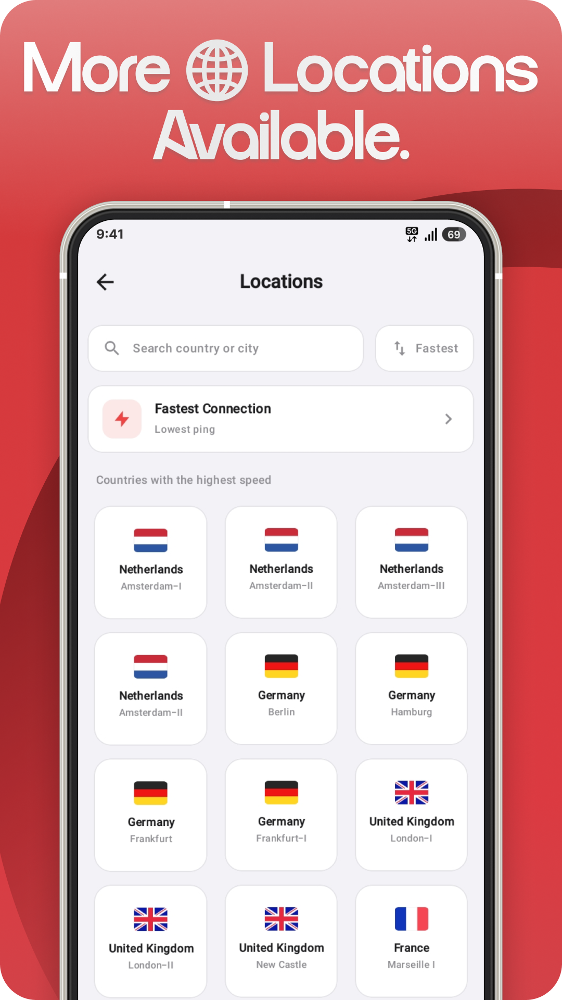
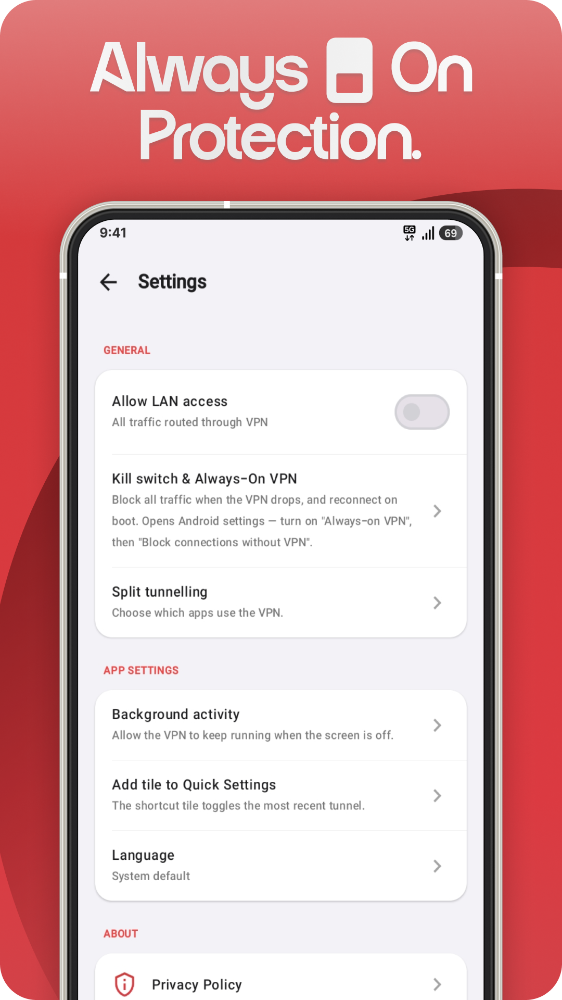
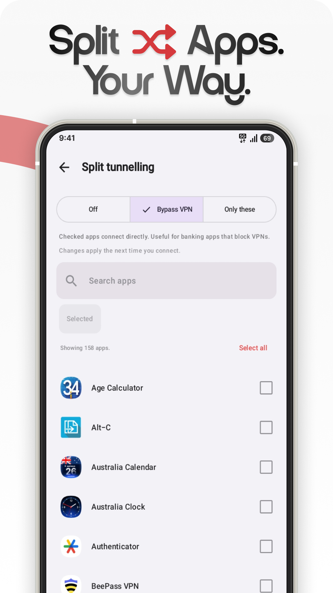
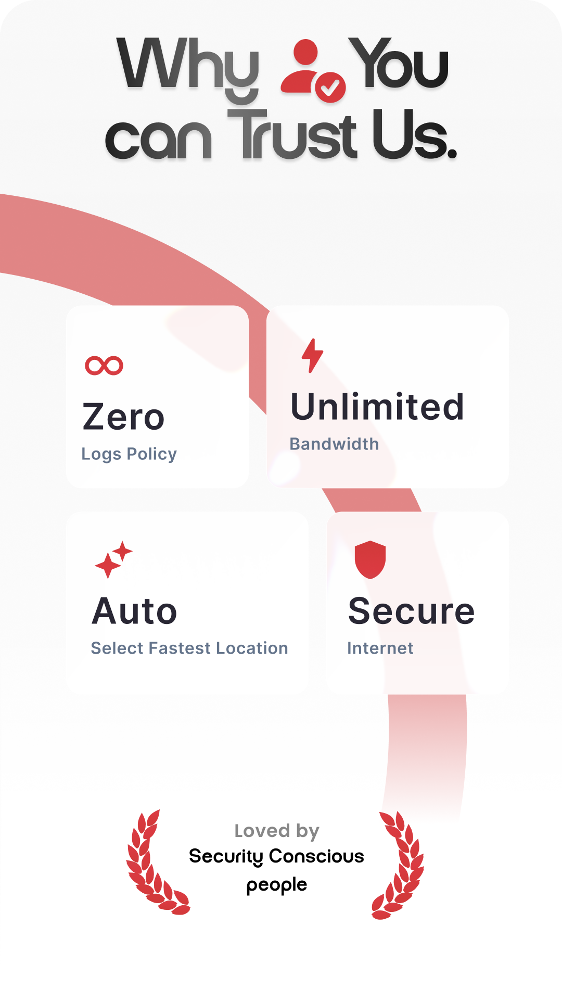

<div align="center">


### Secure Privacy Everywhere.

Free, fast, and private VPN for Android. Smart server selection, a real kill
switch, and per-app split tunnelling. No logs, no account, no data caps.

<br />

[](https://play.google.com/store/apps/details?id=com.vpni.android)
&nbsp;
[](https://github.com/DigitalDTech/vpni_app/releases/latest)
&nbsp;
[](https://github.com/DigitalDTech/vpni_app/releases/latest)

</div>


## Screenshots

<div align="center">







</div>


## On Google Play

<div align="center">

[](https://play.google.com/store/apps/details?id=com.vpni.android)
&nbsp;
[](https://play.google.com/store/apps/details?id=com.vpni.android)
&nbsp;
[](https://play.google.com/store/apps/details?id=com.vpni.android)

[Read the reviews on Google Play](https://play.google.com/store/apps/details?id=com.vpni.android)

</div>


## Features

- Zero-logs policy. We don't track, store, or sell your activity.
- Unlimited bandwidth. No throttling and no data caps.
- Automatic server selection picks a fast server for you.
- Always-on kill switch blocks traffic if the tunnel drops.
- Per-app split tunnelling. Choose which apps use the VPN.
- Reality / VLESS protocol stack. No account required.


## Download and install

Install from [Google Play](https://play.google.com/store/apps/details?id=com.vpni.android) for automatic updates.

You can also download the signed APK from the [Releases](https://github.com/DigitalDTech/vpni_app/releases/latest) page. This is the off-store build with the in-app updater:

1. Download `vpni-vX.Y.Z.apk` from the latest release.
2. Open it on your Android device.
3. If prompted, allow installs from your browser or file manager ("unknown sources").

Existing users are updated in-app, so there's no need to reinstall.

### Auto-update with Obtainium

[Obtainium](https://github.com/ImranR98/Obtainium) can notify you when a new version is published:

1. Install Obtainium.
2. Add app, then paste `https://github.com/DigitalDTech/vpni_app`
3. Obtainium tracks each release and prompts you to update.


## Verify your download

Each release lists the APK's SHA-256 checksum. To check a file:

```bash
sha256sum vpni-vX.Y.Z.apk
```

The output should match the checksum in the release notes.


<div align="center">


VPNi — Secure Privacy Everywhere.

<sub>This repository hosts release binaries only. The app source is maintained privately.</sub>

</div>
